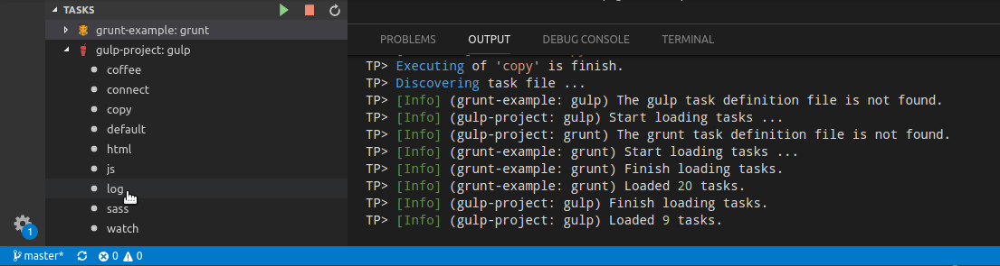

# task-panel

An extension that provides list of gulp and grunt tasks found in your workspaces and allow them to be executed.

## Features

- Show tasks in explorer view.
- Run tasks and show output in the Output View.

## Configuration Settings

The Tasks Panel extension comes with a useful configuration settings.

| Setting                               | Description                                                | Default Value      |
| ------------------------------------- | ---------------------------------------------------------- | ------------------ |
| `tasks-panel.treeCollapsibleState`    | Set initial tree collapsible state after panel show tasks. | `expanded`         |

## Known Issues

- None.

## Release Notes

Tasks Panel support gulp and grunt tasks.

### 0.1.2

- Show tasks in explorer view.
- Run tasks and show output in the Output View.

### 0.1.3

- Fix: grunt tasks are not loaded.

### 0.1.4

- Fix: terminate long running task when vscode is closed.

### 0.1.5

- Fix: Grunt tasks without multiple targets are now shown in the list.

### 0.1.6

- Fix: Can't execute tasks on Windows.

### 0.1.8

- Fix: Wrong encoding in package.json file.
- Fix: Missing dependencies.

### 0.1.9

- Add colorized output.
- Add sorting tasks in ASC order by name (The grunt tasks are sorted in two parts - core and alias tasks).

### 0.1.10

- Add execute task with double click.
- Add configuration for initial state of tasks tree, default value is expanded.

### 0.1.11

- Add Restart function for long running tasks.
